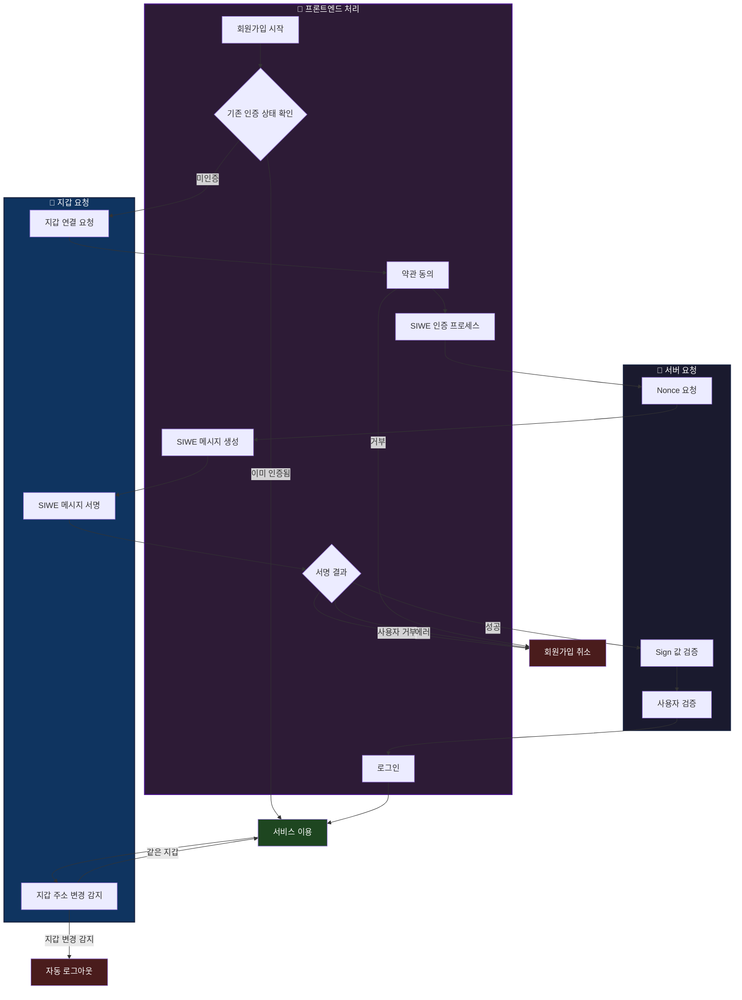

---

---
사용자의 NFT를 불러와 자랑하는 웹사이트를 만들고 있는데, **인증 코드 구현에서 어려움을 겪었습니다.** 다른 Web3 서비스와 달리 자동 로그인 + siwe 기능이 필요했기 때문입니다.




필요한 상태가 너무 많았다.

만약 다시 이때로 돌아간다면 무조건 xstate 를 사용할 것이다.

그 때도 카카오 블로그를 통해서 알기는 했는데 왜? 도입해야 하는가에 대해 대답하지 못했다.

지금은 **선언적으로** 상태를 구현할수 있다.  라고 자신있게 말할수 있다.

코드도 3가지 훅으로 

- 지갑관련
- 서버 관련
- 자동으로 다음단계로 넘어가는 훅

구성되어있었다.차라리 합치는게 나았을거라고 생각한다.

어디서 에러가 나는지  디버깅이 거의 불가능한 코드였다.(나만이 디버깅할수 있는 코드…)

나중에 ai 로 작성한 xstate 예제

물론 똑같이 돌아가진 않겠지만 훨씬 좋아보인다.

```javascript
import { createMachine, assign } from 'xstate';

interface AuthContext {
  address?: string;
  nonce?: string;
  signature?: string;
  signMessage?: string;
  error?: string;
}

type AuthEvent =
  | { type: 'START_SIGNUP' }
  | { type: 'ALREADY_AUTHENTICATED' }
  | { type: 'NOT_AUTHENTICATED' }
  | { type: 'WALLET_CONNECTED'; address: string }
  | { type: 'AGREE_TERMS' }
  | { type: 'REJECT_TERMS' }
  | { type: 'NONCE_SUCCESS'; nonce: string }
  | { type: 'NONCE_ERROR'; error: string }
  | { type: 'MESSAGE_GENERATED'; message: string }
  | { type: 'SIGN_SUCCESS'; signature: string }
  | { type: 'SIGN_REJECTED' }
  | { type: 'SIGN_ERROR'; error: string }
  | { type: 'VERIFICATION_SUCCESS' }
  | { type: 'VERIFICATION_ERROR'; error: string }
  | { type: 'USER_VERIFIED' }
  | { type: 'LOGIN_SUCCESS' }
  | { type: 'WALLET_CHANGED' }
  | { type: 'WALLET_SAME' }
  | { type: 'LOGOUT' };

export const authMachine = createMachine<AuthContext, AuthEvent>({
  id: 'auth',
  initial: 'idle',
  context: {},
  states: {
    idle: {
      on: {
        START_SIGNUP: 'checkingAuth'
      }
    },
    
    checkingAuth: {
      on: {
        ALREADY_AUTHENTICATED: 'serviceActive',
        NOT_AUTHENTICATED: 'connectingWallet'
      }
    },
    
    connectingWallet: {
      on: {
        WALLET_CONNECTED: {
          target: 'agreeingTerms',
          actions: assign({
            address: (_, event) => event.address
          })
        }
      }
    },
    
    agreeingTerms: {
      on: {
        AGREE_TERMS: 'siweProcess',
        REJECT_TERMS: 'signupCancelled'
      }
    },
    
    siweProcess: {
      initial: 'requestingNonce',
      states: {
        requestingNonce: {
          on: {
            NONCE_SUCCESS: {
              target: 'generatingMessage',
              actions: assign({
                nonce: (_, event) => event.nonce
              })
            },
            NONCE_ERROR: {
              target: '#auth.signupCancelled',
              actions: assign({
                error: (_, event) => event.error
              })
            }
          }
        },
        
        generatingMessage: {
          on: {
            MESSAGE_GENERATED: {
              target: 'signing',
              actions: assign({
                signMessage: (_, event) => event.message
              })
            }
          }
        },
        
        signing: {
          on: {
            SIGN_SUCCESS: {
              target: '#auth.verifyingSignature',
              actions: assign({
                signature: (_, event) => event.signature
              })
            },
            SIGN_REJECTED: '#auth.signupCancelled',
            SIGN_ERROR: {
              target: '#auth.signupCancelled',
              actions: assign({
                error: (_, event) => event.error
              })
            }
          }
        }
      }
    },
    
    verifyingSignature: {
      on: {
        VERIFICATION_SUCCESS: 'verifyingUser',
        VERIFICATION_ERROR: {
          target: 'signupCancelled',
          actions: assign({
            error: (_, event) => event.error
          })
        }
      }
    },
    
    verifyingUser: {
      on: {
        USER_VERIFIED: 'loggingIn'
      }
    },
    
    loggingIn: {
      on: {
        LOGIN_SUCCESS: 'serviceActive'
      }
    },
    
    serviceActive: {
      on: {
        WALLET_CHANGED: 'autoLogout',
        WALLET_SAME: 'serviceActive'
      }
    },
    
    signupCancelled: {
      type: 'final'
    },
    
    autoLogout: {
      type: 'final'
    }
  }
});
```